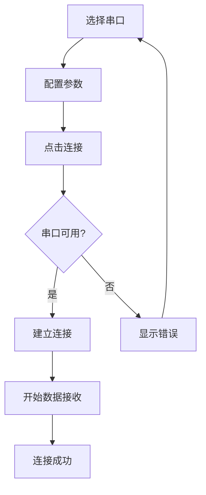
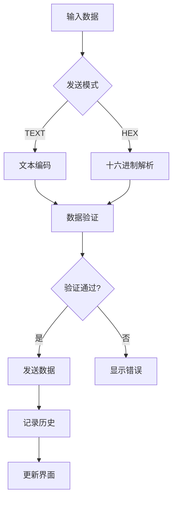
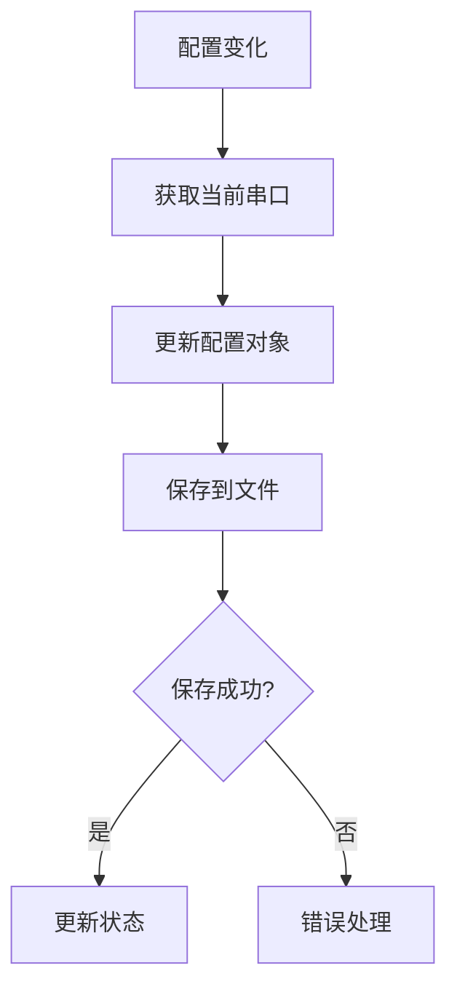

# QSerial 项目设计文档

## 📋 项目概述

QSerial (Quickky Serial Tool) 是一个功能强大的串口调试工具，基于 Python + Tkinter 开发。项目采用模块化设计，支持多串口同时操作、双栏工作模式、配置自动保存等高级功能。

### 核心价值
- **高效调试**：双栏模式支持同时操作两个串口
- **多任务处理**：无限Tab支持多个串口任务并行
- **智能配置**：按串口号自动保存和加载配置
- **用户友好**：直观的界面设计和丰富的功能组件

## 🏗️ 系统架构

### 架构设计原则
- **模块化**：功能组件独立，便于维护和扩展
- **配置驱动**：所有设置可配置且自动保存
- **事件驱动**：基于回调机制的组件通信
- **可扩展性**：支持新功能模块的无缝集成

### 目录结构
```
src/
├── main/                   # 主应用程序
│   └── app.py             # 应用入口和主窗口
├── pages/                  # 页面组件
│   └── work_tab.py        # 工作Tab页面
├── components/             # UI组件
│   ├── serial_settings_panel.py    # 串口设置面板
│   ├── receive_settings_panel.py   # 接收设置面板
│   ├── send_settings_panel.py      # 发送设置面板
│   ├── quick_commands_panel.py     # 快捷指令面板
│   └── send_history_panel.py       # 历史发送面板
└── utils/                  # 工具类
    ├── config_manager.py   # 配置管理
    └── serial_manager.py   # 串口管理
```

## 🎨 界面设计

### 主界面布局

```
┌─────────────────────────────────────────────────────────────────────┐
│ 菜单栏: 文件 | 视图 | 帮助                                              │
├─────────────────────────────────────────────────────────────────────┤
│                        主工作区域                                      │
│ ┌─────────────────────────────────┬─────────────────────────────────┐ │
│ │          左栏/主栏                │          右栏/副栏               │ │
│ │ ┌─────────────────────────────┐ │ ┌─────────────────────────────┐ │ │
│ │ │ Tab1 │ Tab2 │ Tab3 │ + │    │ │ │ Tab1 │ Tab2 │ Tab3 │ + │    │ │ │
│ │ ├─────────────────────────────┤ │ ├─────────────────────────────┤ │ │
│ │ │        工作Tab内容           │ │ │        工作Tab内容           │ │ │
│ │ └─────────────────────────────┘ │ └─────────────────────────────┘ │ │
│ └─────────────────────────────────┴─────────────────────────────────┘ │
├─────────────────────────────────────────────────────────────────────┤
│                        右侧命令面板                                    │
│ ┌─────────────────────────────────────────────────────────────────┐ │
│ │ 快捷指令 │ 历史发送                                              │ │
│ ├─────────────────────────────────────────────────────────────────┤ │
│ │                    面板内容                                      │ │
│ └─────────────────────────────────────────────────────────────────┘ │
└─────────────────────────────────────────────────────────────────────┘
```

### 工作Tab内部布局

```
┌─────────────────────────────────────────────────────────────────────┐
│                           工作Tab                                    │
├─────────────────┬───────────────────────────────────────────────────┤
│   左侧配置区     │                右侧数据区                          │
│ ┌─────────────┐ │ ┌─────────────────────────────────────────────────┐ │
│ │  串口设置    │ │ │                数据接收区                        │ │
│ │             │ │ │  ┌─────────────────────────────────────────────┐ │ │
│ │ 串口号      │ │ │  │                                             │ │ │
│ │ 波特率      │ │ │  │            接收数据显示                      │ │ │
│ │ 校验位      │ │ │  │                                             │ │ │
│ │ 数据位      │ │ │  └─────────────────────────────────────────────┘ │ │
│ │ 停止位      │ │ ├─────────────────────────────────────────────────┤ │
│ │ 流控        │ │ │                数据发送区                        │ │
│ └─────────────┘ │ │  ┌─────────────────────────────────────────────┐ │ │
│ ┌─────────────┐ │ │  │                                             │ │ │
│ │ 打开串口     │ │ │  │            发送数据输入                      │ │ │
│ └─────────────┘ │ │  │                                             │ │ │
│ ┌─────────────┐ │ │  └─────────────────────────────────────────────┘ │ │
│ │  接收设置    │ │ │  ┌─────────────┬─────────────┬─────────────────┐ │ │
│ │             │ │ │  │    发送      │  循环发送    │      清空       │ │ │
│ │ TEXT/HEX    │ │ │  └─────────────┴─────────────┴─────────────────┘ │ │
│ │ 编码方式    │ │ └─────────────────────────────────────────────────┘ │
│ │ 日志模式    │ │                                                   │
│ │ 保存日志    │ │                                                   │
│ │ 自动重连    │ │                                                   │
│ └─────────────┘ │                                                   │
│ ┌─────────────┐ │                                                   │
│ │  发送设置    │ │                                                   │
│ │             │ │                                                   │
│ │ TEXT/HEX    │ │                                                   │
│ │ 循环发送    │ │                                                   │
│ │ 发送周期    │ │                                                   │
│ └─────────────┘ │                                                   │
└─────────────────┴───────────────────────────────────────────────────┘
```

## 🔧 功能模块详解

### 1. 主应用程序 (app.py)

**核心职责**：
- 应用程序生命周期管理
- 主界面布局和组件协调
- 菜单系统和全局功能
- 双栏模式切换控制

**主要功能**：
- **双栏模式**：支持单栏/双栏工作模式切换
- **菜单系统**：文件操作、视图控制、帮助信息
- **配置管理**：全局配置的加载和保存
- **组件协调**：各功能模块间的通信协调

### 2. 工作Tab页面 (work_tab.py)

**核心职责**：
- 单个串口的完整工作环境
- 串口连接和数据收发管理
- 配置面板的集成和协调

**主要功能**：
- **串口管理**：连接、断开、状态监控
- **数据收发**：实时数据接收和发送
- **配置集成**：串口、接收、发送设置的统一管理
- **状态同步**：配置变化的实时响应

### 3. 串口设置面板 (serial_settings_panel.py)

**核心职责**：
- 串口连接参数配置
- 串口列表管理和刷新

**配置项**：
- **串口号**：自动检测可用串口，支持手动刷新
- **波特率**：常用波特率选择，支持自定义输入
- **校验位**：None、Even、Odd、Mark、Space
- **数据位**：5、6、7、8位选择
- **停止位**：1、1.5、2位选择
- **流控制**：None、Hardware、Software

### 4. 接收设置面板 (receive_settings_panel.py)

**核心职责**：
- 数据接收模式和格式控制
- 接收数据的显示和保存管理

**功能特性**：
- **显示模式**：TEXT（文本）/ HEX（十六进制）切换
- **编码选择**：UTF-8 / ASCII（仅TEXT模式）
- **日志模式**：添加时间戳和自动换行
- **数据保存**：自动保存接收数据到文件
- **自动重连**：串口断开后自动重连
- **数据清空**：一键清空接收区数据

### 5. 发送设置面板 (send_settings_panel.py)

**核心职责**：
- 数据发送模式和格式控制
- 循环发送和定时发送管理

**功能特性**：
- **发送模式**：TEXT（文本）/ HEX（十六进制）
- **循环发送**：支持定时循环发送
- **发送周期**：可配置发送间隔（毫秒）
- **数据验证**：HEX模式下的格式验证
- **发送历史**：自动记录发送数据

### 6. 快捷指令面板 (quick_commands_panel.py)

**核心职责**：
- 常用指令的保存和管理
- 快速发送预设指令

**功能特性**：
- **指令管理**：添加、编辑、删除快捷指令
- **分类组织**：支持指令分组和排序
- **快速发送**：双击或按钮发送指令
- **批量操作**：支持多条指令的批量管理
- **导入导出**：指令配置的备份和恢复

### 7. 历史发送面板 (send_history_panel.py)

**核心职责**：
- 发送历史的记录和管理
- 历史数据的搜索和重发

**功能特性**：
- **历史记录**：自动记录所有发送的数据
- **搜索过滤**：支持关键字搜索历史记录
- **重新发送**：双击历史记录重新发送
- **数据统计**：发送次数和时间统计
- **清理管理**：历史记录的清理和限制

### 8. 配置管理器 (config_manager.py)

**核心职责**：
- 应用配置的统一管理
- 配置的持久化存储

**管理范围**：
- **串口配置**：按串口号分类保存
- **界面配置**：窗口大小、面板状态
- **用户偏好**：默认设置、快捷键
- **历史数据**：快捷指令、发送历史

**存储策略**：
- **自动保存**：配置变化时自动保存
- **按需加载**：切换串口时加载对应配置
- **备份恢复**：支持配置的导入导出

### 9. 串口管理器 (serial_manager.py)

**核心职责**：
- 串口硬件的底层管理
- 串口通信的封装和优化

**功能特性**：
- **连接管理**：串口的打开、关闭、重连
- **数据收发**：异步数据接收和发送
- **错误处理**：连接异常的检测和恢复
- **状态监控**：串口状态的实时监控

## 📊 业务流程

### 串口连接流程



### 数据发送流程



### 配置保存流程



## 🎯 用户交互设计

### 操作便捷性
- **一键操作**：常用功能支持一键完成
- **快捷键**：重要功能提供快捷键支持
- **拖拽支持**：文件和数据的拖拽操作
- **右键菜单**：上下文相关的快捷菜单

### 视觉反馈
- **状态指示**：连接状态的直观显示
- **进度提示**：长时间操作的进度显示
- **错误提示**：友好的错误信息提示
- **成功确认**：操作成功的明确反馈

### 用户体验优化
- **响应速度**：界面操作的快速响应
- **数据安全**：配置和数据的自动保存
- **容错处理**：异常情况的优雅处理
- **帮助系统**：完善的帮助和说明

## 🔒 技术特性

### 性能优化
- **异步处理**：串口数据的异步接收
- **内存管理**：大量数据的内存优化
- **界面刷新**：高效的界面更新机制
- **资源释放**：及时的资源清理

### 稳定性保障
- **异常处理**：完善的异常捕获和处理
- **状态恢复**：异常后的状态恢复机制
- **数据校验**：输入数据的严格校验
- **连接监控**：串口连接的实时监控

### 扩展性设计
- **模块化**：功能模块的独立设计
- **接口标准**：统一的组件接口规范
- **配置驱动**：基于配置的功能控制
- **插件机制**：支持功能插件的扩展

## 📈 未来规划

### 功能增强
- **协议解析**：常用协议的自动解析
- **数据分析**：接收数据的统计分析
- **脚本支持**：自动化脚本的执行
- **远程控制**：网络串口的支持

### 界面优化
- **主题系统**：多种界面主题选择
- **布局定制**：用户自定义界面布局
- **多语言**：国际化语言支持
- **无障碍**：无障碍访问支持

### 平台扩展
- **跨平台**：Linux、macOS平台支持
- **移动端**：移动设备的适配版本
- **Web版本**：基于Web的在线版本
- **云服务**：配置和数据的云同步

---

**项目信息**
- **作者**: Aaz
- **邮箱**: vitoyuz@foxmail.com
- **版本**: 1.0.0
- **许可**: MIT License
